# Summary Computer Graphics  2023-2024 (3 ECTS)

- [Summary Computer Graphics  2023-2024 (3 ECTS)](#summary-computer-graphics--2023-2024-3-ects)
  - [1: Introduction](#1-introduction)
  - [2: Meshes](#2-meshes)
    - [Mesh Generation](#mesh-generation)
      - [Marching cubes algorithm](#marching-cubes-algorithm)
      - [Distortion types](#distortion-types)
    - [Mesh Subdivision](#mesh-subdivision)
      - [Butterfly subdivision](#butterfly-subdivision)
      - [Loop subdivision](#loop-subdivision)
      - [Catmull-Clark subdivision](#catmull-clark-subdivision)
      - [Comparison](#comparison)
    - [Wavelet-based Mesh Coding](#wavelet-based-mesh-coding)
    - [Transformations](#transformations)
  - [3.1: Transformations](#31-transformations)
    - [2D Transformations](#2d-transformations)
    - [3D Transformations](#3d-transformations)
    - [Quaternions](#quaternions)
  - [3.2: Point Clouds \& Scene Graphs](#32-point-clouds--scene-graphs)
    - [Point Cloud Meshing](#point-cloud-meshing)
      - [Delaunay](#delaunay)
      - [Graph Cuts](#graph-cuts)
      - [Visibility of Point Sets](#visibility-of-point-sets)
    - [Space Partitioning](#space-partitioning)
      - [Octrees](#octrees)
      - [K-d trees](#k-d-trees)
      - [BSP trees](#bsp-trees)
    - [Fractals](#fractals)
  - [4.1: Shading \& Illumination](#41-shading--illumination)
    - [Interactions Between Light and Surfaces](#interactions-between-light-and-surfaces)
    - [Phong Shading Model](#phong-shading-model)
      - [Modelling Reflections](#modelling-reflections)
    - [Polygon Shading](#polygon-shading)
      - [Flat Shading](#flat-shading)
      - [Gouraud Shading](#gouraud-shading)
      - [Phong Shading](#phong-shading)
    - [Advanced Rendering](#advanced-rendering)
    - [Ray Tracing](#ray-tracing)
    - [Radiosity](#radiosity)
  - [4.2: Texture Synthesis](#42-texture-synthesis)
    - [Pyramidal Methods](#pyramidal-methods)
    - [Image Quilting](#image-quilting)
    - [Wang Tiles](#wang-tiles)
  - [5: Texture Mapping](#5-texture-mapping)
    - [Aliasing](#aliasing)
  - [6: Viewing in 3D](#6-viewing-in-3d)

## 1: Introduction

There are a couple of data structures to know first and it's important to know what makes them distict;

- Mesh: a collection of vertices, edges, faces and normals (defining a volume)
- Image: a rigid structure of values in a grid, basically like a 2D image but extended to 3D
- Skeleton/graph: a collection of vertices and edges to connect them (doesn't define volume, is basically noodles)
- Point cloud: a collection of vertices (a bunch of points in space)

## 2: Meshes

There isn't a clear definition of what a mesh is in this course since the intro says it's vertices, edges and faces while this chapter says it's only vertices and faces BUT to be sure, here is a full list of components that can be found in the context of a mesh:

- Vertex: point in space
- Edge: connection between two vertices
- Face: surface contained within vertices or edges, can be polygonal (triangle, square, hexagon, ...)
- (Normal: vector perpendicular to its parent (either face or vertex))

### Mesh Generation

Surfaces can be defined either explicitly or implicitly. They can also be generated from an image using the marching cubes algorithm.

#### Marching cubes algorithm

This algorithm is aimed at generating a mesh from an **image**.

> Marching cubes method creates mesh from an image, **NOT** from a pointcloud!

1. Locate the surface corresponding to a user-specified threshold: get a threshold value which defines which voxels of your image are considered background and which are considered foreground.
2. Create triangles. 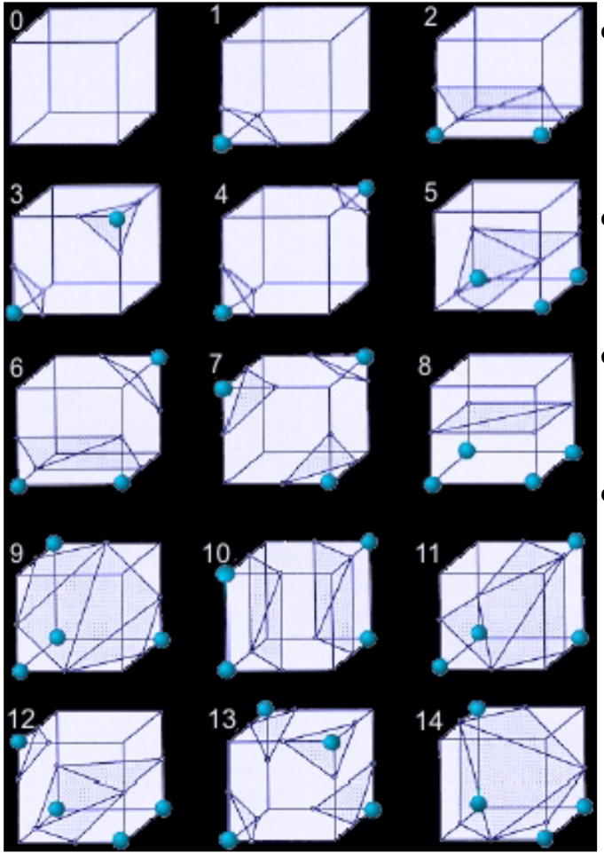
3. Calculate normals to the surface at each vertex. (not so important)

Example for 2D version (marching squares):

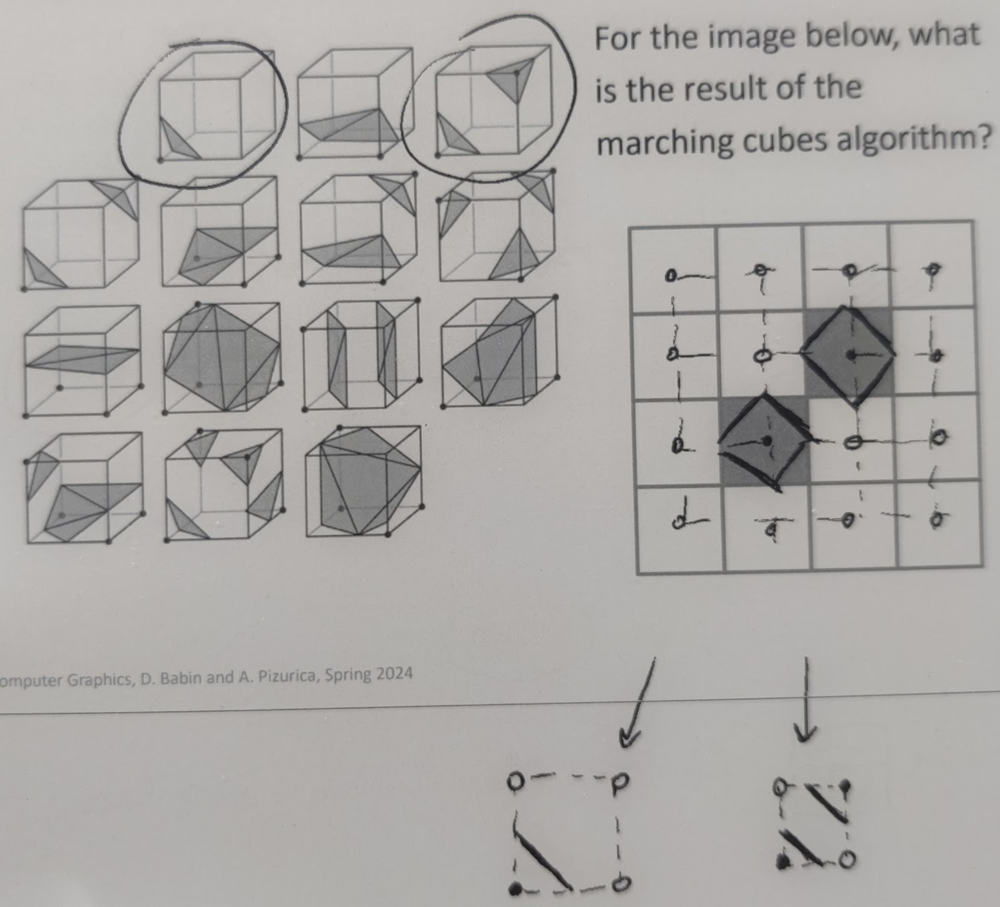

#### Distortion types

While having a mesh of David with billions of vertices at exact locations sounds fantastic for making an accurate model, it will be hell to both store it (file size) and to render it (computational energy). When trying to compress data at a loss of information, distortion can occur. There are two distortion types:

- Resolution: sampling density, or number of samples
- Quantization: sample value range
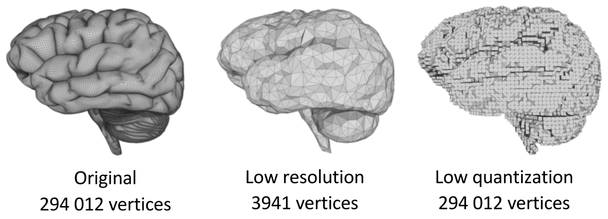

> When it comes to meshes, this typically means that either the mesh contains **less vertices** (**resolution**) or that the **vertex positions have limited values** as they are allocated less bits (**quantization**) (imagine it as the locations can only be integers instead of floats).

**Scalable representation** is a representation where the size is as big as it needs to be (i.e. small resolution when far away because it's rendered small). This is good in rendering to save memory and computation power when possible, because you can load a low resolution model in the scene and increase the resolution gradually as the camera gets closer to the model. This way, we go from a high resolution first to low resolution to then reverse it later.

However, what if we start from a low resolution and want to increase it? In this case we can apply subdivisioning.

### Mesh Subdivision

Mesh subdivision inserts new vertices into a mesh to refine it according to a set of rules, increasing the resolution of the mesh. Subdivision is useful for model generation, where you only change a few vertices and subdivide your mesh to create the full model, and you can go back to the low resolution to change it again and get a big outcome in the subdivided mesh. Most subdivision strategies by first inserting a **new vertex** (or vertices), and then moving the original vertex a little. Here we see three strategies:

- Butterfly
- Loop
- Catmull-Clark

#### Butterfly subdivision

This strategy creates a new vertex by combining the neighboring vertices using different weights, dictated by ω. The original vertices don't move, as denoted by the second formula, resulting in a tight subdivision strategy (the subdivided mesh will preserve original angles rather well).

Note that, if all d points are coplanar, the new vertex will not be extruded and will also be in the same plane, because the original vertex doesn't move.

> Butterfly subdivision works on triangulated mesh

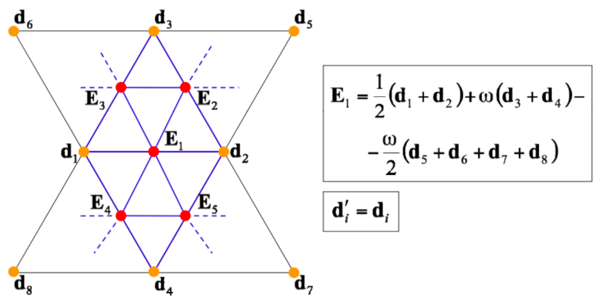

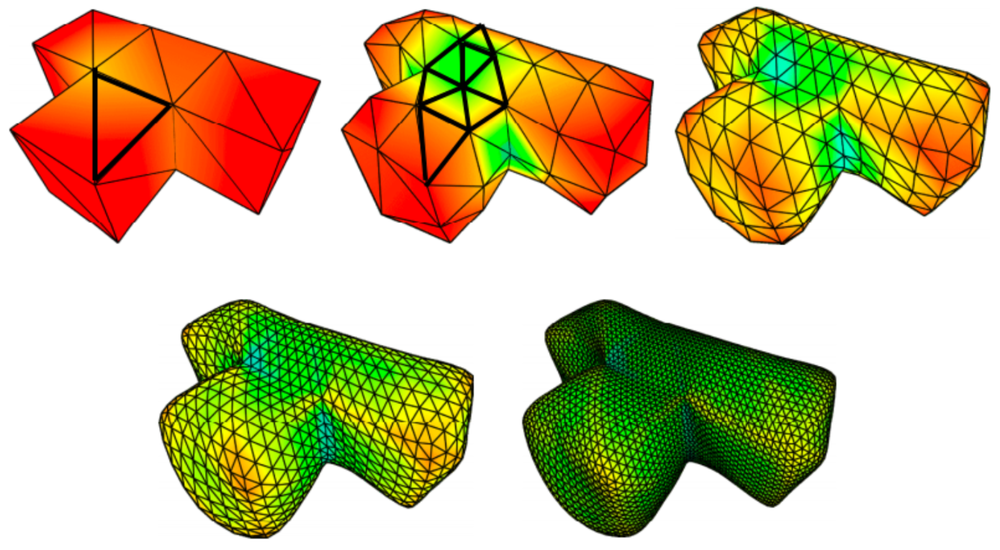

Note how the result retains the sharm corner where the middle cube comes out of the rectangle!

#### Loop subdivision

Loop subdivision first selects one vertex and then uses its neighbors for the rest of the calculations. It creates a new vertex by combining two vertices of an edge and the two vertices of the polygons that make use of that edge. (in the example: E2 is a combination of d1 and d2 (two vertices of the same edge) and d3 and d7 (because the edge d1d2 is part of the polygons d1d2d3 and d1d2d7)).

It then displaces the original vertex, where `n` is the number of neighbors of the chosen vertex (in the example `n=6`). As seen in the formula, the displaces vertex is simply a combination of the original vertex with all its neighbors.

> Loop subdivision works on **triangulated** mesh

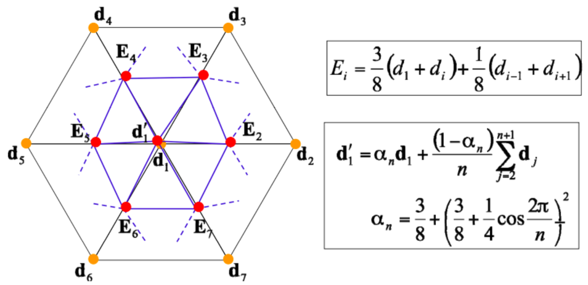

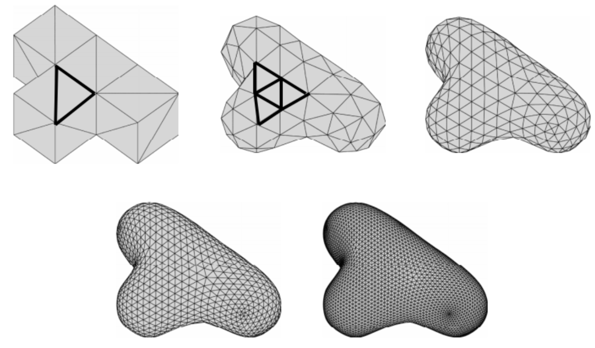

Note how the end result is a lot smoother than butterfly subdivision! This is because of the displacement step.

#### Catmull-Clark subdivision

Catmull-Clark is the technique applied to meshes with quadrangles, and slightly resembles the idea behind loop subdivision. It starts by selecting a vertex to work from (in the example d1). It then creates 2 types of new vertices: first it creates face vertices, creating a new vertex in the middle (by averaging the vertices of that face) of each face that the selected vertex is part of (V), and then creates an edge vertex for each edge (E) by averaging the vertices of that edge with the face vertices of the faces. In the example: d1 is selected -> V2 is made using d1, d2, d3 and d4 -> E1 is made using d1, d2, V1 and V2.

After creating the new vertices, the original selected vertex is displaced using the given formulas, essentially mixing the original vertex with the newly created edge and face vertices. (`n` is the number of neighbors of the original vertex, and `m` is the number of newly created face/edge vertices (not 100% sure)).

> Catmull-Clark subdivision works on mesh containing **quadrangles**

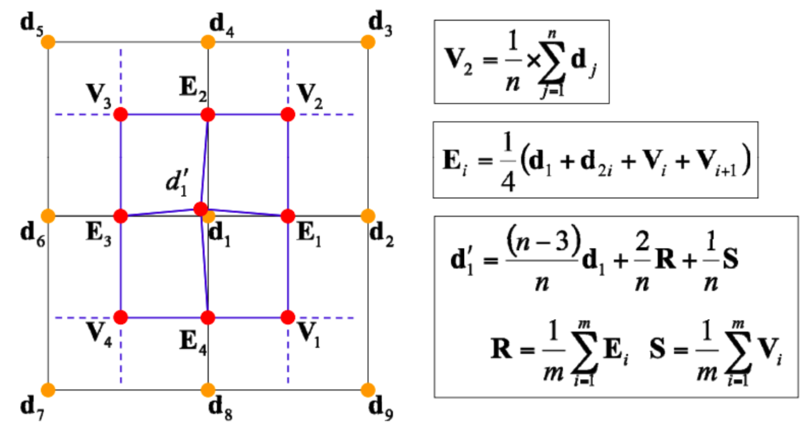

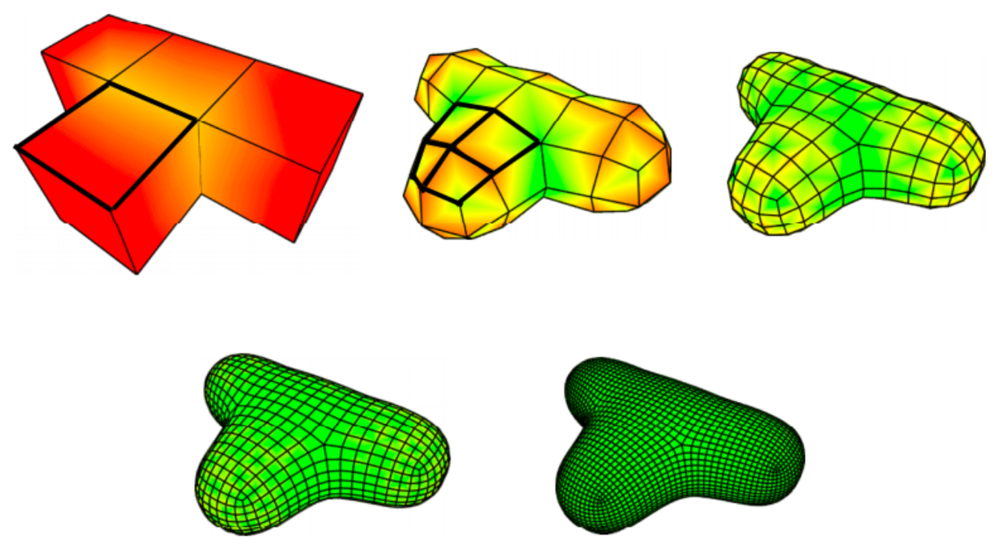

Note how the end result is smooth, just like loop subdivision! This is because of the displacement step.

#### Comparison

When comparing these strategies, it's obvious that a first distinction is that the first two work on triangulated meshes and the last on quadrangle meshes (technically it can be applied on arbitrary polygons too but it doesn't work well half the time). A second distinction is that butterfly subdivion doesn't displace the original vertex and only adds new vertices, keeping the original mesh relatively clear in the end result compared to the other two strategies.

> The key differences between the strategies are the meshes they are applied on (triangulated vs quadrangle) and the smoothness of end result (only new vertices vs vertex displacement).

### Wavelet-based Mesh Coding

The general idea of wavelets is to transform a signal to have a frequency signal representation that's still properly localized in time, giving a general overview while also giving insights to important details.

It's possible to subdivide a mesh into odd and even vertices. After assigning these labels, the goal is to **predict the odd vertices from the even vertices**, and record the difference between the prediction and the real values.

This however isn't enough, because the low resolution model won't end up looking well (imagine subsampling an image purely by selecting a pixel from a 2x2 space, the subsampled will eventually look really bad). For this reason, the scheme is extended with an update to the even vertices.

The result is a step by step subsampling process where, for each step, all vertices are grouped into odds and evens (one vertex is chosen as a starting point and recursively the neighbors are chosen as odd or even, meaning that it's random if a vertex is odd or even), the odds are predicted from the evens and the difference is stored, and the evens get an update to still look good after many subsampling steps.

### Transformations

Lastly, when a mesh is transformed, sometimes the normals have to be recomputed. When translating or rotating the mesh, the normals remain correct. However, scaling and shearing might need to recompute the normals.

> Basic transformations for meshes are translation, rotation, scaling and shearing. Scaling and shearing a mesh will require a recomputation of the normals.

## 3.1: Transformations

### 2D Transformations

The four affine transformations are **translation, rotation, scaling and shearing**. These can be categorized based on what they preserve:

- **Rigid** (preserves length): translation & rotation
- **Conformal** (preserves angles): rigid + uniform scaling
- **Affine** (preserves parallelism): conformal + general scaling & arbitrary shearing
- General linear (preserve lines): all of the above

Scaling, rotation and shearing can all be easily represented with matrix multiplication, but not translation. This is why we use homogenous coordinates, which are basically regular coordinates with an extra dimension to cater to translation.

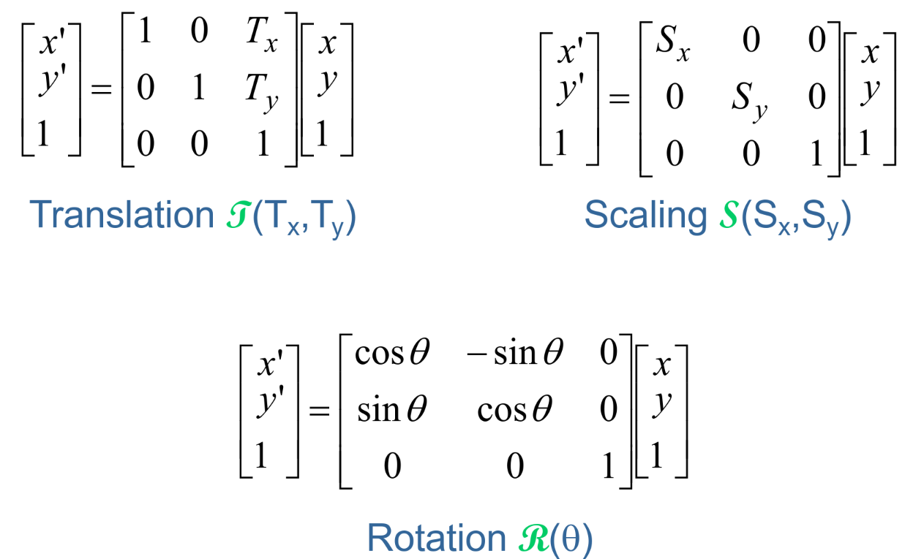
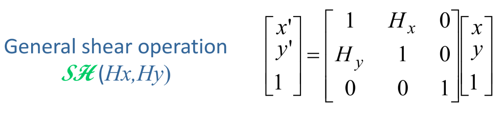

> Shearing can be represented as a combination of rotation, non-uniform scaling and rotating back.
> 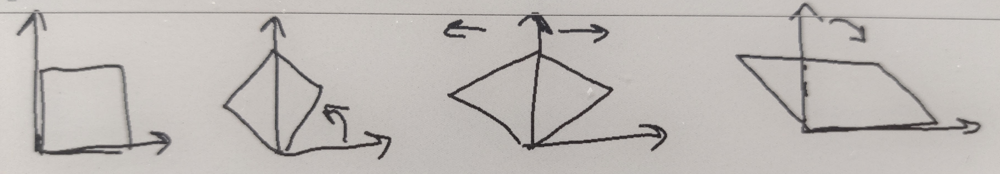

Any complex transformation can simply be broken down into a series of simple transformations: translate to origin, rotate and scale, translate to end location. However, we want this to be as compact as possible of course. How can this be done?

We try to simplify these expressions of elementary tansformations so that we can merge them. For example, sequential transformations of the same type can be merged into one transformation, and sometimes it's possible to commute transformations without an impact on the result (i.e. transformations of the same type or rotation with uniform scaling).

Translation shows the unique property that it can **pseudo-commute** with the other two transformations. This means that, if you translate and then rotate/scale, that you can swap these operations if you use different values for the translation. Unfortunately, scaling and rotation don't show this property.

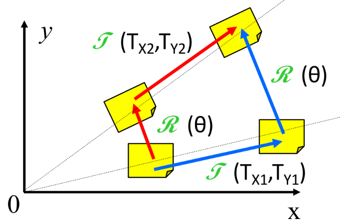

In conclusion, the most general way of showing an affine transformation, is the following matrix:

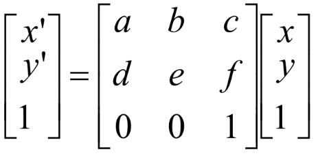

However, this matrix results in 9 multiplications and 6 additions, which is redundant given that it always yields the same 2 formulas. This means that, in practice, the formulas should be used instead of the matrix:

```
X’ = aX + bY + c
Y’ = dX + eY + f
```

A last note is that, if you want to animate a spinning object, the first thought would be to use the corresponding rotation formulas.

```
x’ = x cos(q) – y sin(q)
y’ = x sin(q) + y cos(q)
```

Because each frame only requires a very small angle in rotation, this can be simplified (using cos(q) ~ 1):

```
x’ = x – y sin(q)
y’ = x sin(q) + y
```

However, after a while of using this approximation, the error will have accumulated and become too large. This can be prevented by substituting the first formula into the second:

```
x’ = x – y sin(q)
y’ = x' sin(q) + y
```

### 3D Transformations

3D transformations are a generalization of 2D transformations, meaning that we can consider the general affine transformation as:

```
X’ = aX + bY + cZ + d
Y’ = eX + fY + gZ + h
Z' = iX + jY + kZ + l
```

Whereas 2D rotations only needed a single parameter, 3D rotation requires three. In Euler angle formulation, this is done with a rotation around each axis.

Homogenous coordinates have the same extension from 2D to 3D, and the transformations presented in them are largely the same. Rotation becomes slightly different however. Note the signs for each axis!

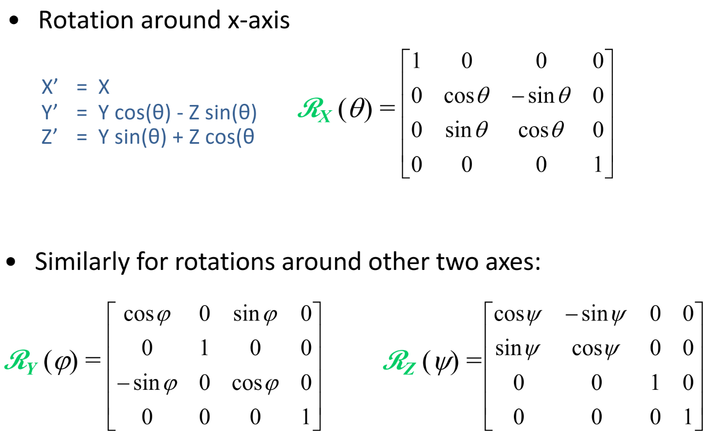

Shearing is also slightly different. For shearing around the z-axis:

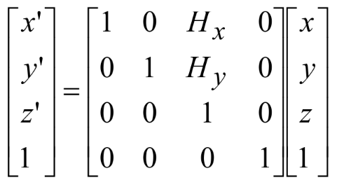

The same principle applies to shearing about x and y-axis.

As with 2D transformations, 3D transformations have the same absorption and pseudo-commutation rules. However, there are some additional properties, without proof:

- Two rotations DO NOT pseudo-commute
- Three rotations and a translation DO pseudo-commute

Besides this, a general positioning (transformation + rotation) or deformation (rotation + scaling) transformation requires 6 parameters, meaning that a general affine transformation requires 12 parameters.

### Quaternions

Quaternions are basically an extension of complex numbers to 4 dimensions. A quaternion can be noted in a few different ways:

- a = r + ai + bj + ck
- a = (q0 + q); q = q1i + q2j + q3k

Where complex numbers had `i² = -1`, quaternions extend this by `i² = j² = k² = ijk = -1`.

Why are we suddenly talking about an extension of complex numbers in computer graphics? Because this system is great for rotating an object! One thing that wasn't mentioned in the previous part was that, with the Euler system, rotations are applied sequentially and that the order is fixed. This can result in a problem called Gimbal Lock: if two axes lign up, then you lose an axis of rotation because two of the three axes will result in the same rotation. For computational complexity, quaternions are also more efficient.

How are rotations now calculated? First, the point you want to rotate is presented as `p = (0, p)`, where the x, y and z components are the coefficients for the complex units i, j and k (fun fact: this type of quaternion, without a real part, is called a pure quaternion). If you now want to rotate this point with an angle t around vector v, you use the following formula:

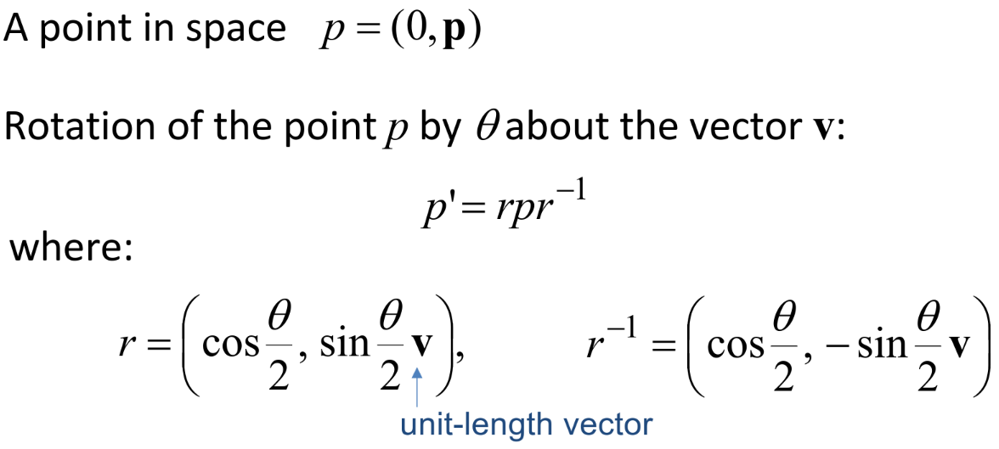

## 3.2: Point Clouds & Scene Graphs

Light Detection and Ranging (LiDAR) is a technique that sends optical pulses and measures the time it takes for each pulse to return to calculate the distance of the object hit by that pulse in order to generate a pointcloud. This results in a huge amount of points or vertices.

LiDAR scans also have a couple of artifacts that usually come with them: non-uniform sampling, holes, noise, bad scan alignment and no (reliable) normals.

> TODO: explain origin from these artifacts

Pointclouds can be visualized either using 3D objects (such as spheres), or as a 2D image with a heatmap. They can also be used to generate a mesh or an image

### Point Cloud Meshing

#### Delaunay

> TODO: explain link between Thales and Delaunay

Imagine you have two meshes created from the same set of vertices. You can compare these meshes to see which one yielded a better result by calculating which one has the **largest minimum interior angle of all polygons**. If you have a quadrangle with an edge in it, and flipping this edge results in a better triangulation, this means the original edge is "illegal". In this case, the mesh police will come and arrest the original edge and let the new edge take its place.

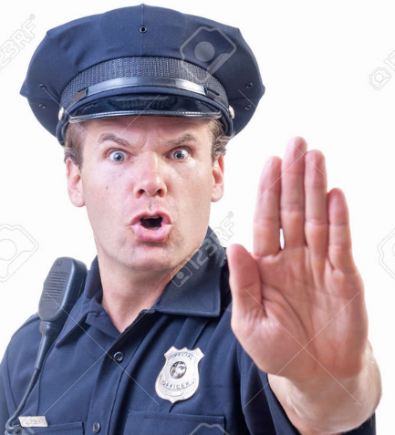

**Thales' theorem** says that if you have a circle with two points on it, all the points on this circle will create the same angle, points outside the circle make a smaller angle and inside the circle make a bigger angle.

Combining these two concepts, we arrive at Delaunay triangulation. Basically, this creates a mesh from a pointcloud with no illegal edges. The end result is that, when you create a circle using the points of each polygon, no vertices are inside another cicle. This is often preferred on perfect data (without errors and uniform sampling), because no interpolation or smoothening happens. The points are fixed and just connected in a mesh.

#### Graph Cuts

When you have a point cloud with holes and noise and want to extract a surface from it, you can do so using graph-based surface extraction.

First, you convert the point cloud to an image with voxels. Then, using mathematical morphology, compute a "crust" that contains the surface. Mathematical morphology is basically the principle that you move a structuring element on an object and erode part of it away or dilate it and add surface to the object.

From this, make a weighted graph structure where the edge weights are denoted with:

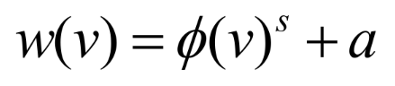

, where `psi` is the distance to the voxels, and `a` is the surface. (I know it doesn't make sense but just go with it since Danilo was confident with it.)

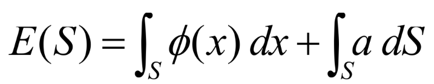

This equation shows the energy which has to be minimized. Basically, the first part is for the distance to the existing voxels, and the second part is for keeping the total surface of the mesh small (you don't want it to randomly get huge). This results in a surface defined in an image, congratulations! 🎉

But how do you go from a mesh to an image? One way is using the marching cubes algorithm, another is using the voxel split-edges.

If you connect all the split-edges of the voxels, you can already create some vertices and edges. This can then be further subdivided using the loops created by the voxel edges.

Another way is by first creating vertices at the center of the voxels. Honestly idk he didn't explain anything in detail you can just use **voxel corners or voxel centers**.

This works well for realistic objects and objects with smooth edges, but less for artificial ones. When we do have sharp edges and we don't want objects that are close together to connect, there is a different algorithm: moving least squares. This works with a least average of a local neighborhood of points. However, the edges will still remain relatively smooth when the desired outcome is sharp as it relaxes noise.

The solution to this is Robust Moving Least Squares. On a high level, you create a number of candidate edges, project your points on these edges and see which candidate is most fit. To create a candidate there are some steps:

1. Extract points near your region of interest (for example edges of object)
2. Project points using RMLS (each point is projected and gets a score based on how far the point is from the projected edge; this step also connects edges into corners)
3. Smoothen result using PCA
4. Connect result into a mesh

These two algorithms are both valid to use, but in their own use cases. You need to know the paradigm you're working in and apply prior knowledge to decide which algorithm is best fit for your case.

#### Visibility of Point Sets

Only show points which would be visible to viewer to: reduce computational energy and make it easier for the viewer. However, points are infinitely small, so how do we define which points are obscured to the viewer? **Hidden Point Removal (HPR)**.

This works in two steps: first do inverse spherical projection, basically projecting all points to a sphere behind the object (assuming the camera is the center of the sphere), then reconstruct the object using the convex hull.

Intuitively speaking, you basically make an inversed version of the object, and then only use the outer part of that inversion to reverse it back to their original state, resulting in only the visible points being reversed.

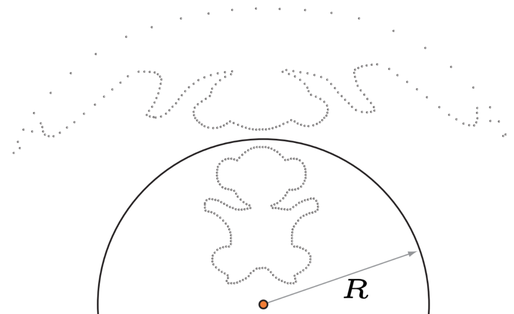

This projection is achieved using the following formula on each point:

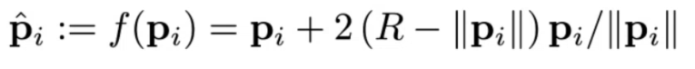

Basically, it subtracts the distance to the point p from the radius R, makes a vector in the direction of p with the calculated length and adds this to p.

This is great for static rendering, but what if it needs to be dynamic? No worries, because you can still start with the above algorithm, and then dynamically add and remove points for each frame that gets rendered. Basically you start with the algorithm above, and whenthe object rotates and gaps are shown, points are added in the gaps and the now visible points are used as a base for the next frame. For efficiency reasons, the chosen points are random each frame. You can imagine this as quickly rotating an object and gradually seeing it get rendered.

> Hidden Point Removal (HPR) works by first creating an **inverse spherical projection** of your points, and then using the **convex hull** to project the visible points back. This results in only the "visible" points being projected back and rendered.

However, now we always went from point cloud to mesh to image, but can't we bypass the mesh step? Neural networks can!

### Space Partitioning

The goal of space partitioning is to partition the world space into segments in order to achieve quick operations (ray tracing, collision detection, ...) on the space and store it in an efficient manner.

#### Octrees

Recursively subdivide part of space containing points. This can have stopping conditions such as minimal amount of points or maximal tree height.

This algorithm makes it very fast and easy to make changes on the fly, and is a good choice when not a lot of dynamic objects are involved. However, it grows really fast, and it's not fit for large scenes.

#### K-d trees

K-d trees are more efficient in storing the space by applying a rule: alternatively split between the dimensions to split the data in equal parts. Basically, in 2D, you would split in x, then y, then x, ... You would find the point that splits the points equally in that dimension and split along that point. This is basically a balanced version between octrees and BSP trees.

#### BSP trees

Binary space partitioning trees subdivide the space into segments using hyperplanes (can be any rotation).

These are good for complex scenes because of efficient storage but only for static because it's expensive to recompute.

It's a good idea to use both octrees and bsp trees for games; one for the dynamic requirements, and one for the complex static requirements.

### Fractals

Basically creating something by repeating itself. If you look at something and you're not sure if it's zoomed in or out, it's probably a fractal. This concept can be used to generate 3D objects such as trees

## 4.1: Shading & Illumination

The goal of shading is to make the objects look 3D because they are projected to a 2D surface (the screen). Without it, objects would look 2D. The parts involved in lighting a scene IRL are the light sources (position, direction, strength etc), the surfaces in the scene (material, orientation) and the position of the viewer.

For example, when you have one light source with 2 surfaces in a scene, a light ray will go to surface A and be partially absorbed and scattered, the scattered part will go to surface B and do the same, bouncing back to A etc. This recursive scattering results in an integral equation called the **rendering equation**. However, in general, this cannot be solved analytically because there are too many factors to take into consideration to keep it perfectly realistic. (Each part of each surface needs to interact with all the other surfaces in a recursive way.)

### Interactions Between Light and Surfaces

A realistic light model is too complex to make, because we would need to keep track of the light coming from every point of the source (imagine a lightbulb, light goes into each direction from each point of the surface of the bulb). This is why we simplify light sources into a few categories:

- Ambient light: the lighting that's present everywhere in a scene
- Point source: light emitted in all directions from a single point, getting weaker with distance
- Spotlight: limits a point source to emit light in a cone
- Distant source: parallel lighting for the whole scene (imagine it like the sun lighting your scene)

Now for the surfaces, which are a lot shorter to describe; a surface can be smooth or rough, and influences either how much light is perfectly reflected or how much is scattered respectively.

### Phong Shading Model

The Phong model is a popular method of modelling the interaction between light and a surface by mixing three types of light a surface can reflct: **diffuse** (rough surface), **specular** (smooth surface) and **ambient** (any surface really). It does so by assigning a couple of vectors to a point on a surface and using those vectors to calculate the resulting light reflected to the viewer. These vectors are:

- **l**: pointing to light source
- **v**: pointing to viewer
- **n**: normal of that point
- **r**: direction of perfectly reflected ray

#### Modelling Reflections

**Ambient reflections** are the result of (mostly large) light sources and the object itself, so this term depends on both the incoming light and the material itself: `I = kL`, where `k` is the reflection coefficient and can be different for each color channel, resulting in three light components for each color.

**Diffuse reflections** are reflections from incoming light that are scattered equally in all directions, and the strength depends on the angle of incoming light, resulting in `cos(t)*L`, with `t` the angle between `l` and `n`. If the vectors are normalized, this `cos` can be written as `l*n`, so now the full diffuse reflection model is: `I = kL(l*n)`, where `k` can again be different for each color.

**Specular reflections** are the reflections of a perfectly smooth surface (imagine a mirror reflecting a lightray at exactly the angle it came in). As with diffuse reflections, the strength depends on the angle between the viewer and the reflected light ray, and normalizing the vectors results in this strength being written as `v*r`. Another coefficient is added, `α`, and it's called the shininess coefficient, and it dictates the broadness of the reflection. The result is: `I = kL(v*r)^(α)`

Adding all of these reflections up results in the final model:

`I = kL(l*n) + kL(v*r)^(α) + kL`

All these `k` coefficients are different from each other (because the ambient reflection of a surface is independent of the specular and diffuse reflection etc), and can all be broken down to one value per RGB channel. Because the `n` and `v` vectors are possibly negative, this equation is further worked out for practical use:

`I = kL*max((l*n), 0) + kL*max((v*r), 0)^(α) + kL`

Furthermore, you can add another coefficient to dictate how the surface deals with the distance `d` to the light source. This can be freely modelled up to a second degree in the denominator (`a`, `b` and `c` can be freely chosen), resulting in the final equation:

`I = 1/(ad²+bd+c) * (kL*max((l*n), 0) + kL*max((v*r), 0)^(α) + kL)`

One wrinkle in this formula is the fact that the reflected vector `r` always needs to be recomputed. We already know and need to use all the other vectors (light, normal and viewer), but this reflected vector adds a little bit of overhead. This is where the Blinn-Phong model comes in.

The Blinn-Phong model removes the need to compute `r` by introducing a new vector `h`, the vector halfway between `l` and `v`. The angle between `r` and `v` is double that between `n` and `h`. This means we can now approximate `(r*v)^α` by `(n*h)^α'`. We need a new `α'` because of the now smaller angle.

### Polygon Shading

#### Flat Shading

Flat shading simply assings a normal to each face and shades the faces in with their one normal. This results in **one lighting calculation per face**.

#### Gouraud Shading

Gouraud shading calculates one color per vertex, where the vertex has a normal. The faces are then shaded simply by interpolating the three vertices. It does so by making a scan line that goes down the face and gets a value for each needed point. This results in **one lighting calculation per vertex**.

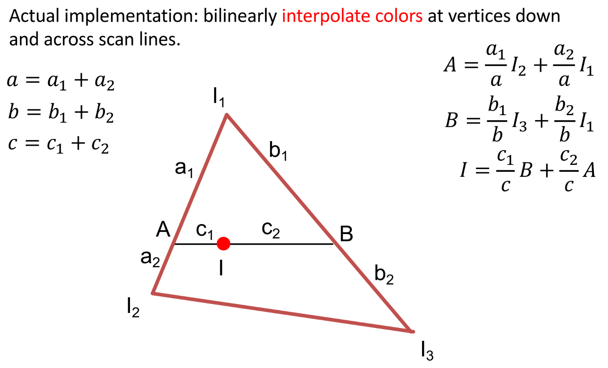

#### Phong Shading

Phong shading applies the previously explained Phong model per pixel. Each pixel needs its own normal, and these normals are sumply an interpolation of the normals of the vertices from that face, using the same method as explain in Gouraud shading. This results in **one lighting calculation per pixel**.

When comparing these shading techniques, it's clear that they each require more computations (one lighting calculation per face -> vertex -> pixel), but this in turn results in a more realistic shading impression each time.

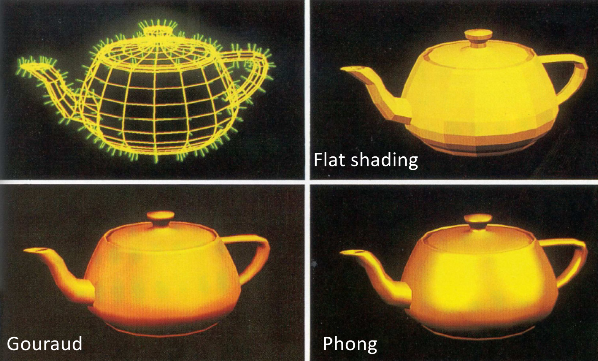

### Advanced Rendering

### Ray Tracing

Ray tracing is the physically accurate way of tracing light rays from a light source around until they potentially hit the viewer. This can however result in many rays never reaching the viewer, resulting in overhead. Ray casting on the other hand sends rays directly from the viewer, meaning that they all are useful, but less physically accurate.

Shadow rays are used in ray casting for determining if a face is lit. When casting a ray to an object, this spot still needs to be able to make an unobstructed path to a lightsource in order for it to be lit. Shadow rays are basically connections between light sources and points where a cast ray hit an object to see if that point would be in light or in shadow. This is a recursive process, as these rays need to keep reflecting and transmitting with other surfaces in the scene.

When a ray hits an object, this ray can either be transmitted or reflected. A used datastructure to keep track of all these rays in a scene is called a ray tree. This keeps track of how a source ray is reflected and transmitted throughout at scene.

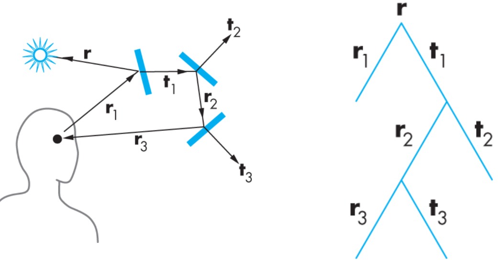

### Radiosity

Ray tracing works best in scenes with highly specular materials. However, for scenes with more diffuse materials and softer lighting, radiosity is preferred. Essentially, this splits the scene in patches and calculates light interactions per patch. A big difference between this method and ray tracing is that ray tracing is viewer dependent, meaning that each relocation of the viewer requires a completely new calculation of the scene lighting, where radiosity is viewer independent and only needs to do minimal calculations when relocating the viewer.

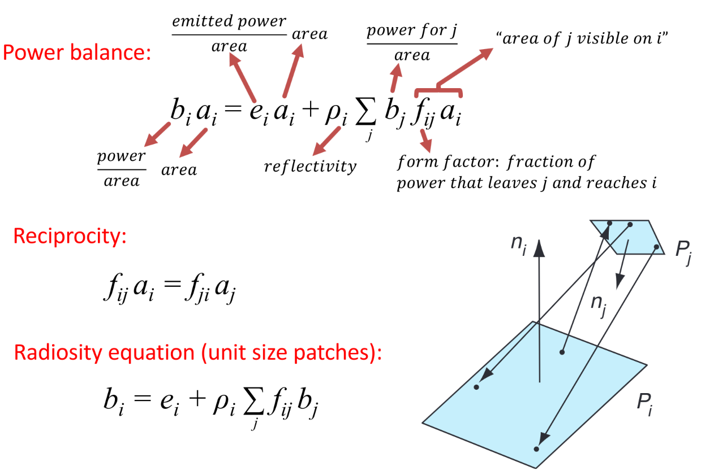

Honestly idk if we need to really understand this full thing, just know that the first part of this equation `e` is used for the emitted light of the patch itself and the second part is used for the reflected light of all the other patches on this patch.

## 4.2: Texture Synthesis

The goal of texture synthesis is creating a larger texture from a smaller base while still making it look correct. There are a couple of texture types and synthesis techniques:

- Deterministic: repetitive textures
- Stochastic: random textures
- Mixture: random textures that display some sort of pattern (the most used in practice)

- Model-based: uses first order statistics (pyramidal methods)
- Tiling and patch: image quilting and Wang tiles
- Hybrid: tiling + stochastic modeling

### Pyramidal Methods

Pyramidal decomposition means creating different levels of detail of a certain texture. The Gaussian pyramid is simply taking your texture and downsampling it a couple of times to create smaller and smaller versions. This can then be used to make a Laplacian pyramid, where the top of the pyramid is the same as the corresponding Gaussian pyramid, and the levels below are instead an image representing the difference needed to apply to the enlarged texture to get the original texture of that size. Each level in the Laplacian pyramid can be broken down further into differences according to orientation.

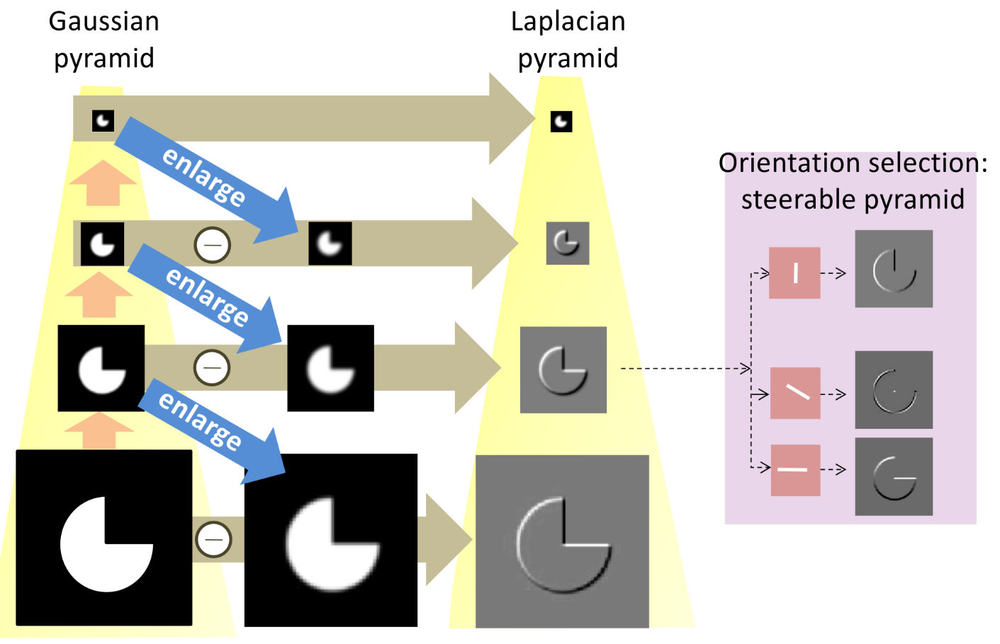

In terms of the Discrete Wavelet Transform, this can also be applied here. Essentially, you compress an image in as many steps as you want to create your pyramid. In each step, you split the image horizontally and vertically and record the difference both horizontally, vertically and diagonally, and keep the resulting downscaled version in the top left corner. This can be done as many times as you like. The resulting difference in each level will contain peaks which indicate edges in the image.

TODO: elaborate method

Pyramidal methods work great for **homogenous stochastic** textures, but don't perform well when generating textures with a certain clear pattern.

### Image Quilting

This method essentially takes samples from a given texture to base itself off of when creating the new texture. Using these samples, they are sequentially places next to and under eachother with a small overlapping region. After this, the overlapping regions are merged in such a way that the two blocks have an optimal transition. This is done by basically calculating where the border should be in the overlapping region (this border is never a straight line, mostly it's wobbly.)

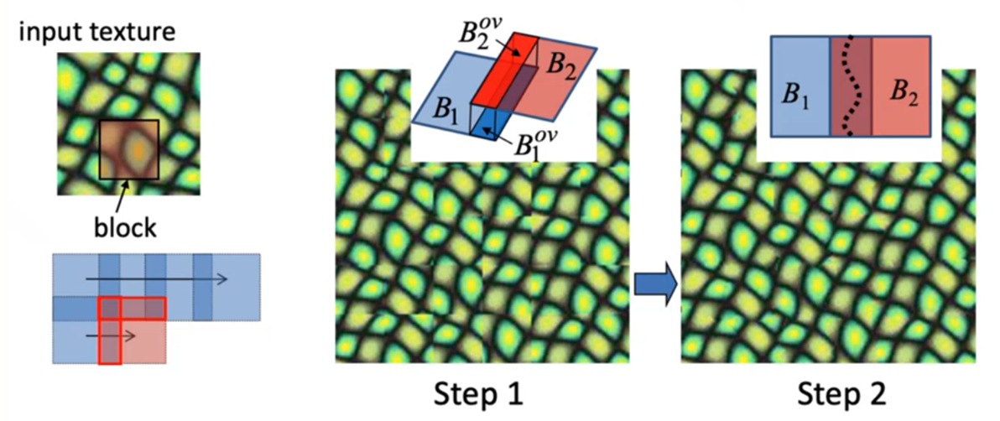

The first step of positioning the overlapping blocks sequentially can be done randomly, but it's better to do it semi-randomly with **block-matching**. This is simply a condition where you choose a random new block and check if the difference in the overlapping regions between the two blocks is below a certain threshold before accepting the new block.

The second step makes use of the quadractic error surface. Basically, you convert your pixels in the overlapping region to nodes of a graph. You then assign the quadratic error (or just the square of the difference) of each pixel to the node. After this, you calculate the shortest path through this zone to get your optimal border.

This method works relatively well for all types of textures. This does come at the cost of computational complexity. It's also difficult to decide the block size to sample the original texture with, which does have a big influence.

Another fun application of image quilting, with some modification of the original method, is texture transfer. Basically, if you have a texture and an image you want to apply the texture on, you kind of do the same two steps as regular image quilting. The first step, however, now makes samples and sees which samples correspond the most to certain regions of the target image. For example, transferring the texture of an orange to the image of a pear will make samples of the orange and correspond the highlight of the orange to the highlight of the pear. Basically this way the algorithm can match certain samples with certain regions of the target image. The second step is then the same.

> The original objective function of image quilting to be used for texture transfer is modified by adding a correspondance factor to the first step to assign a value to how well a certain sample fits in a certain target region.

### Wang Tiles

Wang tiles essentially define a set of tiles that you can nicely line up in a grid while still staying random, without the need of overlapping regions and quilting. At first, mr Wang said that if you have a set that can make a correct tiling, this will eventually become periodic. However he was proved wrong 5 years later when someone proved there was a set of like hundres of tiles that become aperiodic. Recently, a set of 11 tiles has been found that's also aperiodic. There are also two rules regarding correct tiling and aperiodicity:

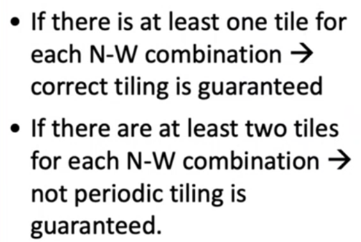

The second rule has the following intuition: if you are about to place a tile and notice it would produce periodicity, choose the other one.

> The minimal set of aperiodic Wang tiles is 11.

Wang tiles can be made from a base texture simply by doing image quilting! This means that you create a set of tiles that already show the property of wang tiles with image quilting, and so when you created your set there is no more need for calculation of the optimal borders, you just line up the tiles, resulting in a low computational complexity for very large textures.

> To create a set of Wang tiles, it's possible to use image quilting. You sample the base texture and stitch them together. Then, you can cut out the inner part of the larger tile to get one Wang tile, and you can use the original tiles again in a different configuration to create other wang tiles.

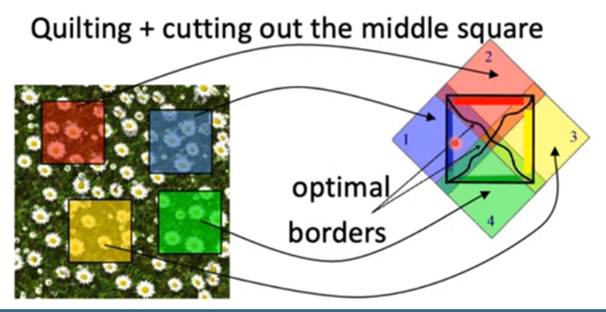

This base principle is already great for generating a homogenous texture, but what if you wanted to make an inhomogenous one? You simply extend the base principle by assigning a density to each corner of your tiles. Now, when you create tiles, you need to assign a density to each corner of your tile. Lining them up now requires an additional rule of also adhering to the corners.

> Basic Wang tiles can be extended with binary coding each corner to assign some property to them. This does result in more tiles, as lining up tiles correctly now also requires the corners to correspond.

Normally you would think that a set of normally 8 tiles would be extended to 128 tiles `(8 * 2^4)`, but because only three corners need to line up, this can be reduced to 64 tiles `(8 * 2^3)`.

> Applying this logic to the previously mentioned set of aperiodic Wang tiles, the smallest set of aperiodic and non-homogenous Wang tiles would be `11 * 2³ = 88`.

Fun fact: there was something called the Einstein problem (doesn't have anything to do with the person, just german for "one stone"), which was searching for a single shape to fill the entire space aperiodically. This has been solved in 2015!

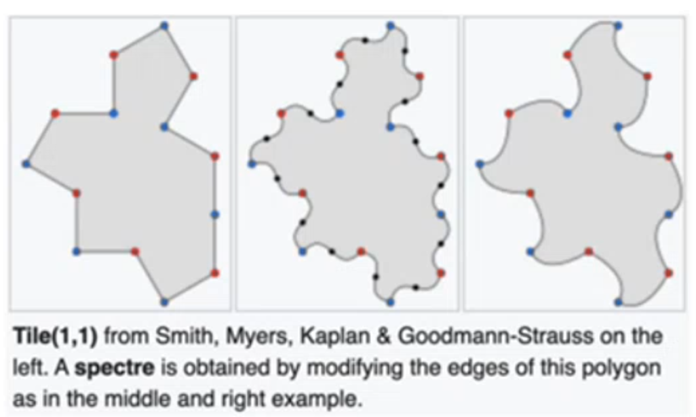

## 5: Texture Mapping

In the previous part we learned how to use a small texture image and expand it to make a larger texture. This part is concenred with actually mapping a texture to an object. There are three types of texture mapping:

- Texture mapping: mapping an image containing a texture to a mesh to fill in the polygons
- Environment mapping: mapping the environment to an object to simulate a mirror-like effect
- Bump mapping: simulating elevation on the object

Texture mapping happens at the end of the rendering pipeline, for efficiency reasons. When the whole scene is created and you know what parts are visible and which are not, it's more efficient to map the textures only to what is visible.

>Texture mapping may sound easy, but there are a couple of coordinate systems involved in the process:
>
>- **Parametric** coordinates: each object has its own coordinates
>- **Texture** coordinates: coordinates within the texture image
>- **Object** or World coordinates: where the texture mapping takes place
>- **Window** (screen) coordinates: where the final image exists

Basically what happens is you want to know for a pixel on the screen, what in the world that pixel shows, and what that part of the object corresponds to in the texture. This is called backward mapping.

One solution to the mapping problem is two-part mapping. Basically, you first map a texture to a simple geometry around the object, and then map that onto the actual object. Generally, this can either be done with cylindrical, spherical or box mapping. The second step (mapping from intermediate object to actual object) has three methods: using the normals of the intermediate object, using the normals of the target object, or using vectors from the center of the target object.

Sidenote: it's also possible to break a complex object down into individual parts and apply texture mapping to those individual parts instead of directly on the whole object.

### Aliasing

When an object has a fine texture and is far enough in space, simply using the above method will result in a problem called aliasing. As shown in the image below, when you sample using the grid of pixels of your screen, entire parts of the texture will be ignored even if it's half of the texture (the blue gets ignored but it's really important).

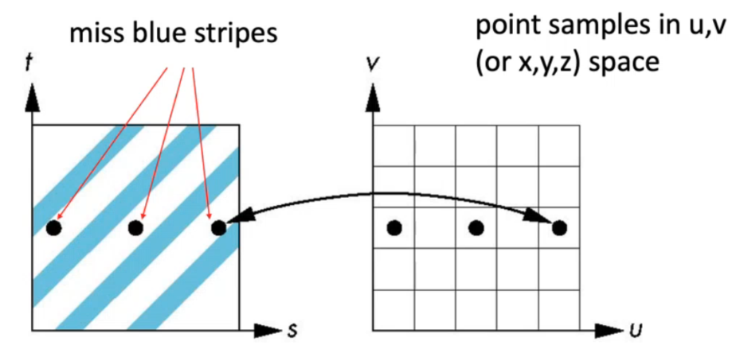

One solution to this is area averaging. This method takes the area of a surface instead of a point and takes the average of this area of the texture.

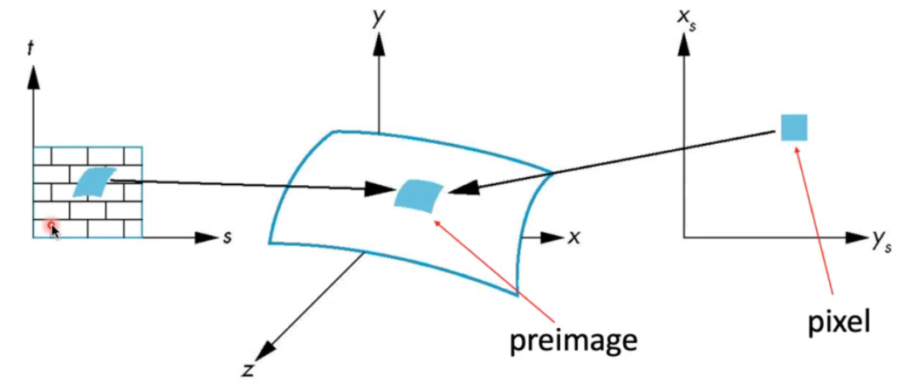

Another problem that exists is when a small part of a texture gets mapped to a large part of the surface (magnification), or when a large part of a texture gets mapped to a small part of the surface (minification). To fight this, mipmaps exist. This is basically a pyramid structure with various levels of details for a texture. Now, when viewing an object from a distance, you can just take the correct level of detail to sample the texture from, or interpolate between two levels (either bilinear or trilinear).

However, this can result in a blurred or too averaged color (e.g. the checkerboard that became completely gray). An improvement on this is anisotropic mipmap filtering. This has largely the same technique, but instead of sampling from an equal area around the pixel, a skewed area gets sampled. This in turns requires an anisotropic mipmap pyramid. Instead of simply downsampling the texture, you now also make a squashed version in each direction for each level (e.g. one horizontal and one vertical downscaled version).

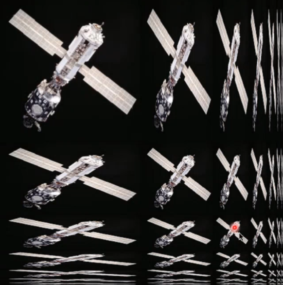

In the image below, the difference in how isotropic vs anisotropic works can be seen.

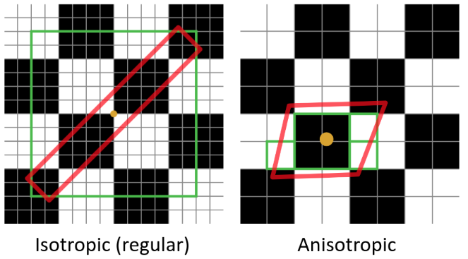

**Environment mapping** is the concept of mapping the environment onto an object, mostly to make it look transparent or reflective. This is either done by using a cube or a sphere.

> **Environment mapping** is used for mapping an environment on an object to make it look either **reflective** or **transparent**.

**Bump mapping** applies an illusion of height displacement on an object by influencing the way light interacts with the object, but doesn't actually change the geometry of the object. By mapping a "texture" on the object where each pixel is a grayscale value indicating how much displacement should be there. This does have a problem where the illusion break at certain viewing distances or camera angles, because the bumps aren't really applied to the model, just simulated. This is improved by **displacement maps**. This does apply changes to the underlying mesh instead of faking it.

When great detail or high realism is needed and computational complexity can be high, displacement maps are a good choice. For high performance scenarios where fine details are needed and closeups won't often happen, bump maps are better. For example, in a videogame an object which the player can hold vs a wall of the environment.

> Bump mapping changes the look of an object by influencing the way it interacts with light, but doesn't change the actual geometry, meaning that from certain angles the object still appears flat (for example when looking at the edge). Displacement mapping solves this by actually changing the geometry of the object (the vertex placement, not the normals).

## 6: Viewing in 3D
